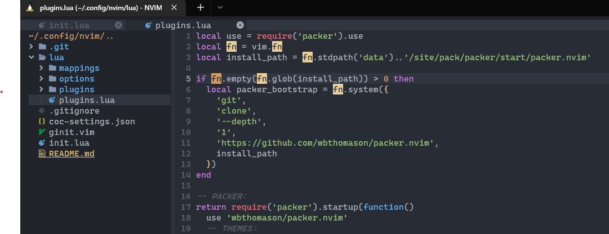
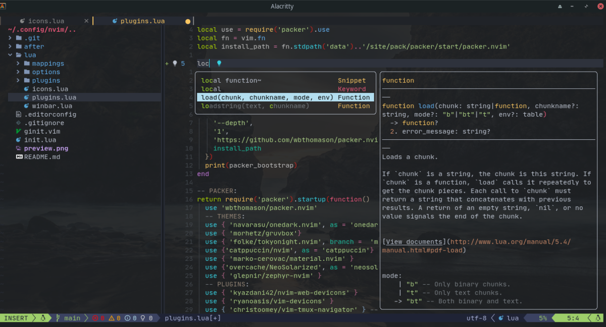

# Neovim Frontend & Backend Config

<!--  -->





### ⚡ About

This is my personal Neovim setup, which is an extension of [LazyVim](http://www.lazyvim.org), already equipped with a quite good and easy-to-configure configuration.

### 🌱 Contribute

You can contribute by making a **pull request** with any _bugfix_ or _feature_ that you want to add :D

If you don't have an idea, you can follow these steps:

- Fork the project (optional in case you have a permission error)
  Or clone it on your local machine

- Create a new branch with:

  ```bash
  $ git checkout -b <new branch>
  ```

- When you have all the changes you have:

  ```bash
  $ git add .
  ```

  ```bash
  $ git commit -m "a description"
  ```

  ```bash
  $ git push origin <new branch>
  ```

And do a **pull request** to the **main** branch

### 📦 Requirements

- Neovim >= 0.9.0

- Git >= 2.19.0 (for clone this project and dependencies inside neovim config)

- GripGrep >= 13.0.0

- FzF >= 0.40.0 (dependes on some plugins that use this fuzzy finder)

- A C compiler in your path and libstdc++ installed [(Windows users please read this)](https://github.com/nvim-treesitter/nvim-treesitter/wiki/Windows-support)

- Some terminal like Kitty, Alacritty, iterm2 or warp

- A recommendation is install a Nerd Font for ligatures and display icons

## ❗ Important

For a good operation of this configuration and to take **advantage of all** the Plugins, we recommend you to use v8 or higher that adds many improvements and support for many things

More information below:

- [Official Documentation](https://github.com/neovim/neovim/wiki/Installing-Neovim)

- [Releases](https://github.com/neovim/neovim/releases)

## Usage

When cloning the repository, in case the folder is named _neovim-dotfiles_, change the name to **nvim** so that Neovim recognizes it

### 📚 Install Neovim:

For **Windows** run one of the two commands within **powershell**, you can use **choco** or **scoop**

```bash
$ scoop install neovim

# Or

$ choco install neovim -y
```

And for **Linux** and **MacOs** : [neovim/wiki/Installing-Neovim](https://github.com/neovim/neovim/wiki/Installing-Neovim)

or see this custom gist, on how to install Neovim on different Linux distributions:

- [gist.github.com/mrLuisFer/install-neovim](https://gist.github.com/mrLuisFer/19b8bc00d7e1295a1a7453a010b5d623)

Also you need install python neovim support.

```bash
$ sudo apt-get install python3-neovim python3-pip

$ pip install pynvim
```

## 🌙 Install Manager:

In this config use **packer** to handle and install plugins.

To install **Packer.nvim** you can run any of these commands

Linux, Unix

```bash
git clone --depth 1 https://github.com/wbthomason/packer.nvim\
 ~/.local/share/nvim/site/pack/packer/start/packer.nvim
```

If you use Arch Linux, there is also an [AUR package.](https://aur.archlinux.org/packages/nvim-packer-git/)

Windows (Powershell)

```bash
git clone https://github.com/wbthomason/packer.nvim "$env:LOCALAPPDATA\nvim-data\site\pack\packer\start\packer.nvim"
```

More information about packer:

- [Documentation](https://github.com/wbthomason/packer.nvim)
- [Tips and Tricks](https://github.com/wbthomason/packer.nvim/wiki/Tips-and-Tricks)
- [Requirements](https://github.com/wbthomason/packer.nvim#requirements)

### 📘 Setup Windows:

```
$ cd %APPDATA\Local\nvim
```

````bash
If you want to test another branch, change `main` to to the name of the branch you want to test

But the main branch is so to speak the stable version

```bash
$ git clone -b main https://github.com/mrLuisFer/nvim.git .
````

If you have an error like `'C' compiler not found`:

Open a terminal as a Admin and run:

```
$ choco install zig
```

### 🐧 Setup Linux:

```bash
$ mkdir -p $HOME/.config/nvim

$ cd $HOME/.config/

$ git clone -b develop https://github.com/mrLuisFer/nvim.git .
```

### 🌈 Colorschemes

If you do not like the color that comes by default, you can execute the command inside **neovim:** `:colorscheme + TAB` and you will see a list of themes that you can select

## 📦 LSP Config

[What's LSP?](https://microsoft.github.io/language-server-protocol/)

[In this configuration use lspconfig](https://github.com/neovim/nvim-lspconfig)
And **Lsp-Installer** for install lsp languages -> [williamboman/nvim-lsp-installer](https://github.com/williamboman/nvim-lsp-installer)

Or `:LspInfo` for see the languages you have setup

## ⚠ Warning

It may be that when you enter the cloned configuration in nvim for the first time, you will get multiple errors

But don't worry just press `Enter` or `q` and run this command **:PackerInstall** or **PackerSync**
Several plugins will be downloaded, then **restart neovim (exit and enter neovim again)**

## 🤖 Setup GitHub Copilot

In this setting you have the option to enable GitHub Copilot for smart autocompletion.

First you must be able to use Copilot, once activated in your account, execute:

```
:Copilot setup
```

With this it will open a page in your browser where you will perform an authentication and with that it will be ready :)

If in case the autocomplete does not appear, execute:

```
:Copilot enable
```

If you want to read more about this plugin I leave you the documentation:

- [github/copilot.vim](https://github.com/github/copilot.vim)

Made with 💙 [by mrLuisFer](https://mrluisfer-linktry.netlify.app/)
